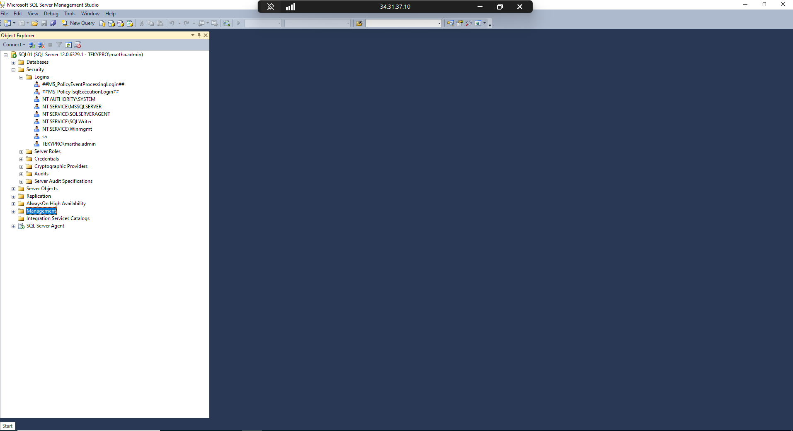
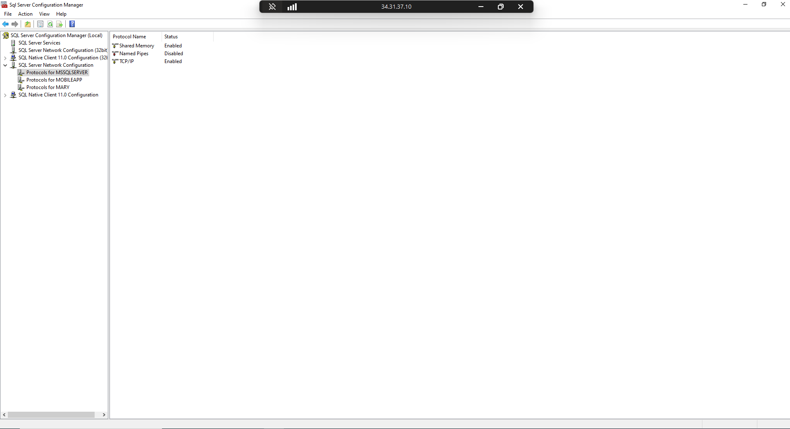

# Architecture

This folder contains the high-level architecture of the SQL Server DBA lab.

The lab simulates a real enterprise environment with:
- A Domain Controller
- Multiple SQL Server nodes
- Centralized authentication using Active Directory
## Architecture Screenshots

## Architecture Screenshots

### GCP VM Infrastructure

### Active Directory

### SQL Server Connectivity (SSMS)

### SSMS Connection Validation

### SQL Server Configuration Manager

